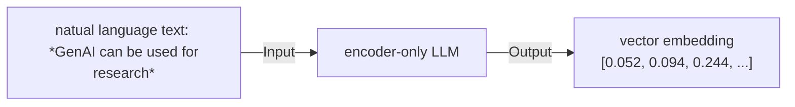

# Generating embeddings

While Decoder-only LLMs gained massive popularity via their usage in chatbots, Encoder-only LLMs can be used for a wider variety of tasks. Decoder-only LLMs "generate" tokens ("text") one at a time probabalisticsally. Encoder-only LLMs on the other hand take text as their input, tokenize it and generate "embeddings" as their output. Here, we shall walk through a task of generating embeddings from a text snippet.



:::tip
Embeddings have the ability to encode the semantic meaning of the natual language text/images!
:::

The snippet below uses the `text-embedding-3-small` model to create 32-dimensional floating point vector embeddings for the input string:

```python
from portkey_ai import Portkey

portkey = Portkey(
    base_url="https://ai-gateway.apps.cloud.rt.nyu.edu/v1/",
    api_key="",  # Replace with your Portkey API key
    virtual_key="",  # Replace with your virtual key
)

response = portkey.embeddings.create(
    model="text-embedding-3-small",
    input="GenAI can be used for research.",
    encoding_format="float",
    dimensions=32,
)

print(response["data"][0].embedding)
```

and gives the following response:
```
[0.052587852, 0.094195396, 0.24439038, 0.104940414, -0.028921358, -0.31591928, -0.1846261, 0.221018, 0.033215445, -0.1382735, -0.14776362, -0.15058714, 0.057725072, -0.23435123, 0.07956805, -0.32156628, -0.08454841, 0.04066637, -0.022215525, 0.19090058, -0.11160703, 0.22258662, -0.06843088, -0.22854735, 0.1033718, -0.38085997, 0.2933312, -0.023215517, 0.20768477, -0.039333045, 0.17192031, -0.14180289]
```

## Applications of embeddings

Embeddings are typically used for:
-  retrieval-augmented generation
-  search
-  classification

:::info
Embeddings are typically stored in a *vector* database which is designed for efficient storage and fast retrieval of vectors.
:::
