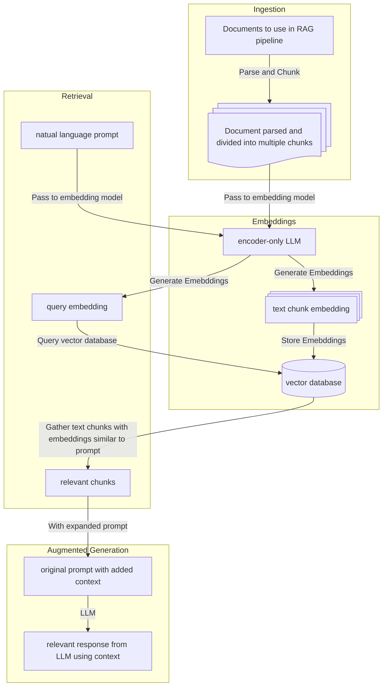

# Retrieval-augmented generation

Large Language Models only know about the data they were trained upon and do not have the context needed to be effective at answering questions based on:
- private datasets
- newer knowledge past the cutoff date (i.e. the date at which data collection was frozen)

To get around this issue, one of the most popular techniques is Retrieval-augmented generation, the most basic version of which is outlined below:



It starts with the "Ingestion" phase where a document to be used as context is parsed and broken into chunks. These chunks are then converted to embeddings and stored in a vector database (which specializes in storing and retrieving vectors). This setup allows us now "retrieve" the required context for an incoming prompt before it is sent to an LLM. The "retrieval" phase consists of converting the prompt to an embedding and looking up embeddings for chunks of the document that are similar to it. The text chunks associated with the embeddings similar to the embedding for the query are then added as additional context to the prompt before passing it to an LLM.
The LLM now has the associated context it needs to generate an relevant response to the prompt.

Here's a script to test this out yourself, once you have API access to an embedding model and an LLM: https://github.com/NYU-RTS/rts-docs-examples/tree/main/genai/rag . You can run it to ask a question about a recent event that occurred after the knowledge cutoff for the dataset used to train the LLM:
```sh
ss19980@ITS-JQKQGQQMTX ~/D/p/r/g/rag (main)> uv run rag_basic.py \
                                                 https://en.wikipedia.org/wiki/2025_London_Marathon \
                                                 "Which athletes won the 2025 London Marathon?"
...
Processing chunks: 100%|████████████████████████████████████████████████████████████████████████████████████████████████████████████████████████| 44/44 [00:13<00:00,  3.22it/s]
----------------------------------------------------------------
Query embedding vector (first 5 dims) is:  [-0.013783585280179977, 0.022411219775676727, -0.018617955967783928, -0.04355597868561745, -0.009368936531245708]
----------------------------------------------------------------
Retrieved chunks and similarity scores:

('The 2025 London Marathon was the 45th running of the London Marathon; it took place on 27 April 2025.[1][2]', 0.8441829085350037)
('1. ^ Martin, Andy (26 April 2025). "London Marathon 2025: route, runners and everything else you need to know". The Guardian. Retrieved 26 April 2025.\n2. ^ Poole, Harry (26 April 2025). "Will \'greatest\' London Marathon line-ups break records?". BBC News. Retrieved 26 April 2025.\n3. ^ a b c d "2025 London Marathon results". NBC Sports. 27 April 2025. Retrieved 27 April 2025.', 0.837587296962738)
('Venue, 45th London Marathon = London, England. Date, 45th London Marathon = 27 April 2025. Champions, 45th London Marathon = Champions. Men, 45th London Marathon = Sabastian Sawe (2:02:27). Women, 45th London Marathon = Tigst Assefa (2:15:50). Wheelchair men, 45th London Marathon = Marcel Hug (1:25:25). Wheelchair women, 45th London Marathon = Catherine Debrunner (1:34:18). ←\xa020242026\xa0→, 45th London Marathon = ←\xa020242026\xa0→', 0.8032743334770203)
----------------------------------------------------------------
Generated response from LLM without additional context is:

The 2025 London Marathon has not happened yet!

The event typically takes place in **April** each year. We will only know the winners after the race takes place in April 2025.
---------------------------------------------------------------
Generated response from LLM with additional context is:

The athletes who won the 2025 London Marathon are:

*   **Men:** Sabastian Sawe
*   **Women:** Tigst Assefa
*   **Wheelchair men:** Marcel Hug
*   **Wheelchair women:** Catherine Debrunner
E20250611 14:32:54.595919 362220 server.cpp:47] [SERVER][BlockLock][] Process exit
ss19980@ITS-JQKQGQQMTX ~/D/p/r/g/rag (main)>
```
