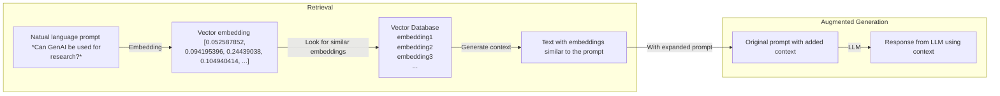

# Retrieval-augmented generation

Large Language Models only know about the data they were trained upon and do not have the context needed to be effective at answering questions based on
- private datasets
- newer knowledge past the cutoff date (i.e. the date at which data collection was frozen)

To get around this issue, one of the most popular techniques is Retrieval-augmented generation.

```mermaid
flowchart LR;
    A["Natual language prompt <br> *Can GenAI be used for research?*"]
    B["Vector embedding <br> [0.052587852, 0.094195396, 0.24439038, 0.104940414, ...]"]
    C["Vector Database <br> embedding1 <br> embedding2 <br> embedding3 <br> ... "]
    D["Text with embeddings similar to the prompt"]
    E["Original prompt with added context"]
    F["Response from LLM using context"]
    subgraph Retrieval
    direction TB
    A-- "Embedding" -->B;
    B-- "Look for similar embeddings" -->C;
    C-- "Generate context" -->D;
    end
    D-- "With expanded prompt" -->E;    
    subgraph Augmented Generation
    direction TB
    E-- "LLM" -->F;
    end
```
