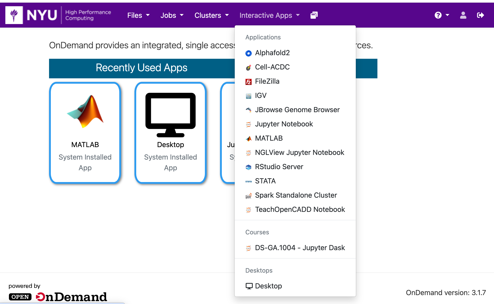
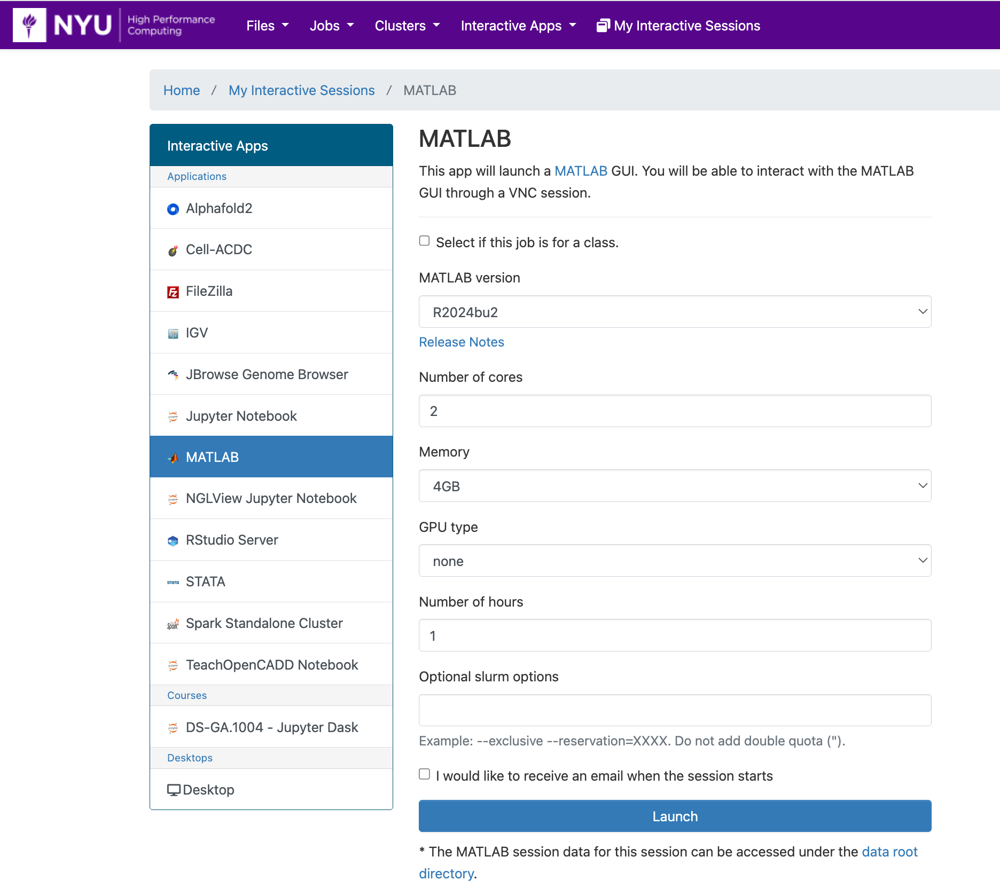
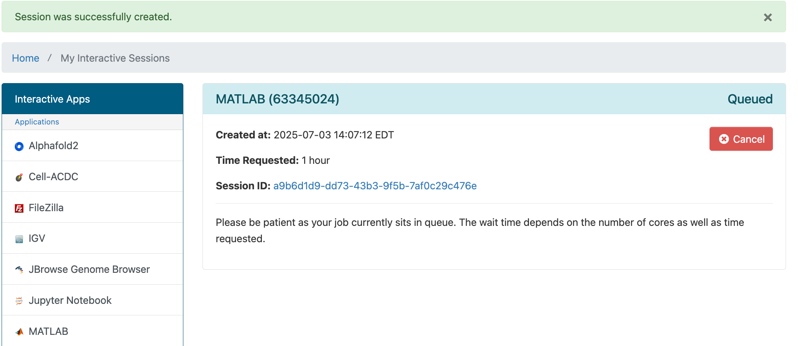
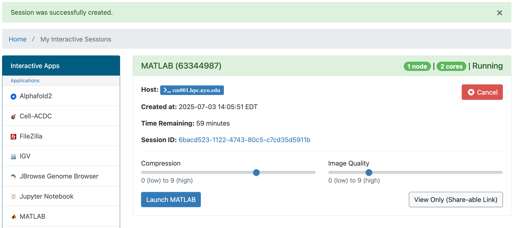
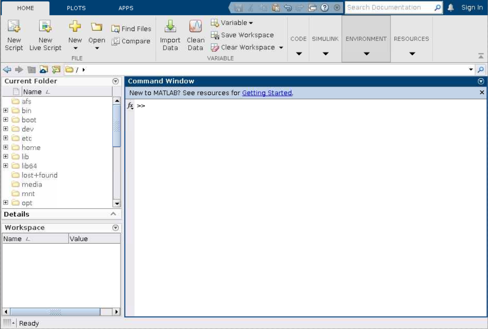

# Matlab in OOD

## Getting Started
You can run Matlab in OOD by going to the URL [ood.hpc.nyu.edu](http://ood.hpc.nyu.edu) in your browser and selecting `MATLAB` from the `Interactive Apps` pull-down menu at the top of the page.  As you can see below, once you've used it and other interactive apps they'll show up on your home screen under the `Recently Used Apps` header.

:::note
Be aware that when you start from `Recently Used Apps` it will start with the same configuration that you used previously.  If you'd like to configure your Matlab session differently, you'll need to select it from the menu.
:::



## Configuration

You can select the version of Matlab to use, the number or cores, amount of memory, GPU type (if any), amount of time, and optional Slurm options.



::::tip
Please be aware that when you run each version of Matlab for the first time, the working directory will default to your home directory `/home/NetID`.  
:::warning
Be careful not to go over your quota for `/home`.  You can find your current usage with the `myquota` command.  Please see our [Storage documentation](../03_storage/01_intro_and_data_management.mdx) for details about your storage options.
:::
Each time you start it up after that it will set its working directory to the last directory you were in.  If you'd like to change this behavior, so that you always start at the same directory:
1.   click on `ENVIRONMENT` in your `Home` panel
1.   select `Preferences`
1.   select `Current Folder`
1.   select `initial working folder preferences`

This will allow you to set the full path of the initial working folder you would prefer.  Be sure to hit the `Apply` button, so your changes are applied.
::::

:::tip
Another step you may wish to take to keep Matlab from filling up your `/home` directory is to create symlinks from `/scratch` to `/home` for internal Matlab folders.  You can do this by running the following commands:
```bash
# make sure you're in your /home directory
cd
mkdir /scratch/$USER/.matlab
mkdir /scratch/$USER/.MathWorks
ln -s /scratch/$USER/.matlab
ln -s /scratch/$USER/.MathWorks
``` 
:::

## Matlab running in OOD

After you hit the `Launch` button you'll have to wait for the scheduler to find you node(s) to run on:


Then you'll have a short wait for Matlab itself to start up.<br />
Once that happens you'll get one last form that will allow you to:
-   make changes to compression and image qualtiy
-   open a terminal window on the compute node your Matlab session is running on
-   get a link that you can share that will allow others to view your Matlab session



Then after you hit the `Launch Matlab` button you'll have the familiar Matlab Desktop to use.


