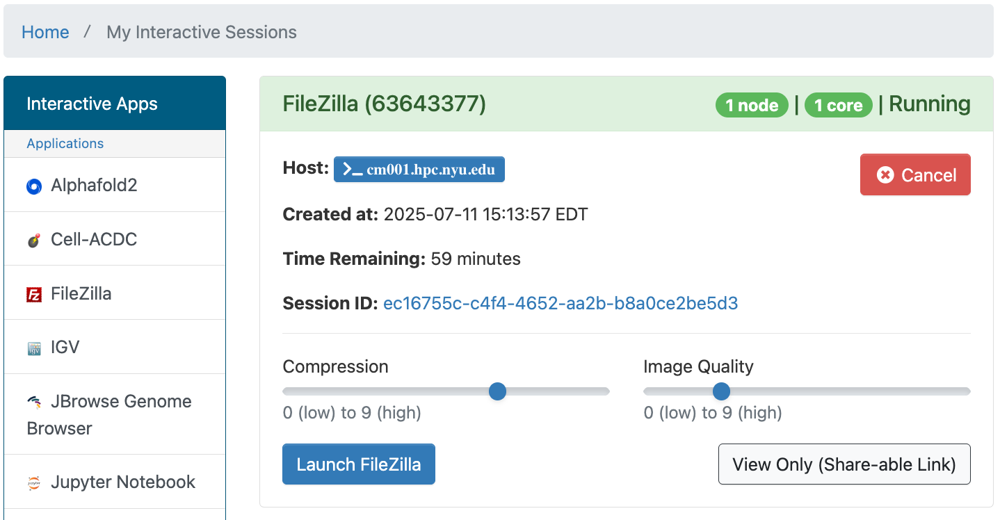
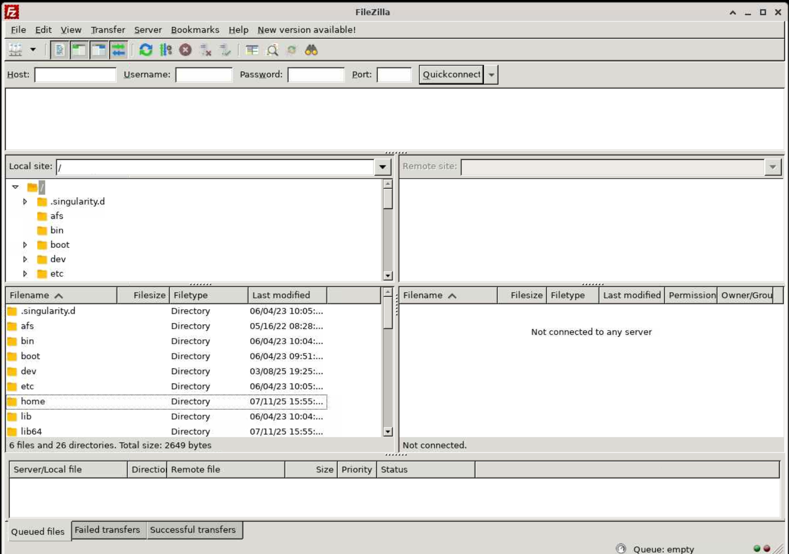

# FileZilla

As mentioned in [File Transfer Clients](../03_storage/03_data_transfers.md#file-transfer-clients), FileZilla is a client for transferring files.  It has been installed on OOD as a convenience, but be aware that you can use many of the other methods described in the [Data Transfers](../03_storage/03_data_transfers.md) section of our documentation for transferring your files on OOD, since they all use the same underlying filesystems.

## FileZilla running in OOD

First, you'll be able to select the number of cores, amount of memory, job duration and optional slurm options, you'd like.

After you hit the `Launch` button you'll have to wait for the scheduler to find you node(s) to run on, and then you'll have a short wait for FileZilla itself to start up. 

After all that, you'll get the chance to set some options for your environment:
-   Compression
-   Image Quality

:::tip
You can also get a 'view only' link that you can share with others and a link to your session files for debugging
:::

After you hit the `Launch FileZilla` button you'll have the familiar FileZilla Desktop to use.

