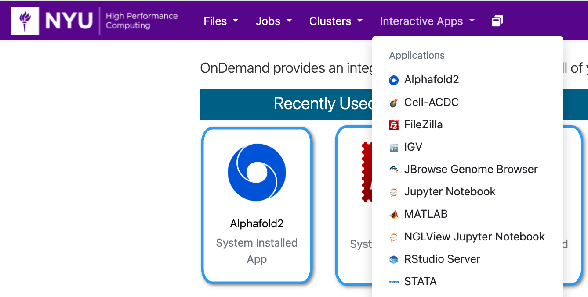

# AlphaFold2

The AlphaFold2 software predicts protein structure from an amino acid sequence.  Please see the paper [Highly accurate protein structure prediction with AlphaFold](https://www.nature.com/articles/s41586-021-03819-2) for details.

## Getting Started
You can run AlphaFold2 in OOD by going to the URL [ood.hpc.nyu.edu](http://ood.hpc.nyu.edu) in your browser and selecting `AlphaFold2` from the `Interactive Apps` pull-down menu at the top of the page.  As you can see below, once you've used it and other interactive apps they'll show up on your home screen under the `Recently Used Apps` header.

:::note
Be aware that when you start from `Recently Used Apps` it will start with the same configuration that you used previously.  If you'd like to configure your AlphaFold2 session differently, you'll need to select it from the menu.
:::



## Configuration

You can select the version of AlphaFold2 to use, the number or cores, amount of memory, GPU type (if any), amount of time, and optional Slurm options.  You'll also be able to select either `/home` or `/scratch` to use as your root directory.


 
:::warning
If you select to use `/home` as your root directory be careful not to go over your quota.  You can find your current usage with the `myquota` command.  Please see our [Storage documentation](../03_storage/01_intro_and_data_management.mdx) for details about your storage options.
:::

## AlphaFold2 running in OOD

After you hit the `Launch` button you'll have to wait for the scheduler to find you node(s) to run on:


Once that's done, just hit the `Connect to Jupyter` button to see your Jupyter environment.

## Running the example notebook

Please follow these steps to run the example notebook:
1.   Get a shell prompt (This can be done in either of the following two ways):
        -   In OOD:
            1.   Select the `Clusters` pull-down menu at the top of the page
            1.   Select `Greene Shell Access`
        -   Use your terminal to log into Greene:
            1.   Follow the instructions on [Connecting to HPC](../02_connecting_to_hpc/01_connecting_to_hpc.mdx)
1.   Create a directory to save the example notebook:
        ```bash
        [NetID@log-1 ~]$ mkdir /scratch/$USER/AlphaFold2_example
        ```
1.   `cd` into this new directory:
        ```bash
        [NetID@log-1 ~]$ cd /scratch/$USER/AlphaFold2_example
        ```
1.   Copy the example notebook into your directory:
        ```bash
        [NetID@log-1 AlphaFold2_example]$ cp /scratch/work/public/examples/alphafold/alphafold-test.ipynb .
        ```
1.   You can now go back to the main OOD site in your browser at [ood.hpc.nyu.edu](http://ood.hpc.nyu.edu) and start an AlphaFold2 interactive Session.
        :::tip
            -   You'll need a GPU for the example notebook so select either version `2.0.0` or `2.1.1 amber-gpu`
            -   One core is enough for the example notebook
                -   You can select more if you'd like, but your job may sit in the queue longer before starting.
            -   4GB of memory is enough for the example notebook
                -   Again, you can select more memory if you'd like, but it may take longer for you job to get picked up from the queue.
            -   Select `any` type of GPU for the least amount of time spent in the queue
        :::
1.   When your Jupyter session starts you should be able to navigate to the new directory you created above and work through the example notebook.