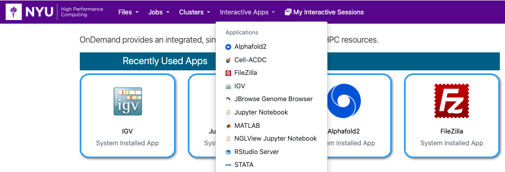

# Integrative Genomics Viewer (IGV) 

The IGV is a high-performance, easy-to-use, interactive tool for the visual exploration of genomic data.

Please see the following links for details:
-   [User Guide](https://igv.org/doc/desktop/)
-   [Tutorial Videos](https://www.youtube.com/channel/UCb5W5WqauDOwubZHb-IA_rA)

## Getting Started
You can run IGV in OOD by going to the URL [ood.hpc.nyu.edu](http://ood.hpc.nyu.edu) in your browser and selecting `IGV` from the `Interactive Apps` pull-down menu at the top of the page.  As you can see below, once you've used it and other interactive apps they'll show up on your home screen under the `Recently Used Apps` header.

:::note
Be aware that when you start from `Recently Used Apps` it will start with the same configuration that you used previously.  If you'd like to configure your IGV session differently, you'll need to select it from the menu.
:::

## Configuration

You can select the number or cores, amount of memory, amount of time, and optional Slurm options.

## IGV running in OOD

After you hit the `Launch` button you'll have to wait for the scheduler to find you node(s) to run on:

Then you'll have a short wait for IGV itself to start up. 
Once that happens you'll get one last form that will allow you to:
-   make changes to compression and image qualtiy
-   open a terminal window on the compute node your IGV session is running on
-   get a link that you can share that will allow others to view your IGV session

Then after you hit the `Launch IGV` button you'll have the familiar IGV interface to use.

