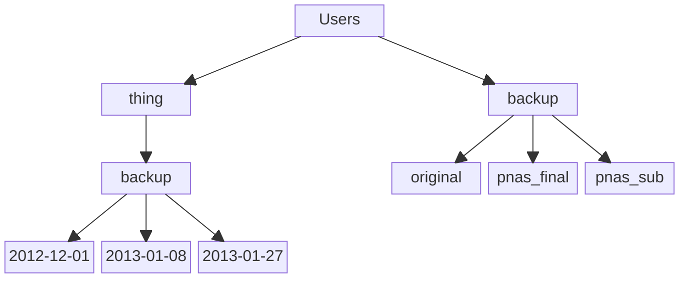

# Moving around and looking at things

:::note[Overview]
Questions
-   How do I navigate and look around the system?

Objectives
-   Learn how to navigate around directories and look at their contents
-   Explain the difference between a file and a directory.
-   Translate an absolute path into a relative path and vice versa.
-   Identify the actual command, flags, and filenames in a command-line call.
-   Demonstrate the use of tab completion, and explain its advantages.
:::

At this point in the lesson, we’ve just logged into the system. Nothing has happened yet, and we’re not going to be able to do anything until we learn a few basic commands. By the end of this lesson, you will know how to “move around” the system and look at what’s there.

## System Architecture

File Systems:
The NYU HPC clusters have multiple file systems for user’s files. Each file system is configured differently to serve a different purpose.

| Space    | Environment Variable | Space Purpose | Flushed | Allocation (per user) |
| -------- | -------------------- | ------------- | ------- | --------------------- |
| /home	   | $HOME                | Program development space; storing small files you want to keep long term, e.g. source code, scripts. | NO	| 20 GB |
| /scratch | $SCRATCH             | Computational workspace. Best suited to large, infrequent reads and writes. | YES. Files not accessed for 60 days are deleted.	| 5 TB |
| /archive | $ARCHIVE             | Long-term storage	| NO | 2 TB |
| /vast    | $VAST                | Flash memory for high I/O workflows | YES. Files not accessed for 60 days are deleted. | 2 TB |

Please see [HPC Storage](../03_storage/01_intro_and_data_management.mdx) for more details.

Right now, all we see is something that looks like this:
```bash
[NetID@login-1 ~]$ 
```

The dollar sign is a prompt, which shows us that the shell is waiting for input; your shell may use a different character as a prompt and may add information before the prompt. When typing commands, either from these lessons or from other sources, do not type the prompt, only the commands that follow it.

Type the command `whoami`, then press the Enter key (sometimes marked Return) to send the command to the shell. The command’s output is the ID of the current user, i.e., it shows us who the shell thinks we are:
```bash
$ whoami
<NetID>
```

More specifically, when we type `whoami` in the shell:

1.   finds a program called whoami,
1.   runs that program,
1.   displays that program’s output, then
1.   displays a new prompt to tell us that it’s ready for more commands.

Next, let’s find out where we are by running a command called `pwd` (which stands for “print working directory”). (“Directory” is another word for “folder”). At any moment, our current working directory (where we are) is the directory that the computer assumes we want to run commands in unless we explicitly specify something else. Here, the computer’s response is `/home/<NetID>`, which is `<NetID>`'s home directory. Note that the location of your home directory may differ from system to system.
```bash
$ pwd
/home/<NetID>
```

So, we know where we are. How do we look and see what’s in our current directory?
```bash
$ ls
```

`ls` prints the names of the files and directories in the current directory in alphabetical order, arranged neatly into columns.

<details>
<summary>
:::info[**Differences between remote and local system**]
Open a second terminal window on your local computer and run the `ls` command without logging in remotely. What differences do you see? <br />
**[click to see the solution]**
:::
</summary>

**Solution**
You probably see something like this:
:::note[Output]
```bash
    Application Documents   Library Music   Public
    Desktop     Downloads   Movies  Pictures
```
:::
In addition you should also note that the preamble before the prompt ($) is different. This is very important for making sure you know what system you are issuing commands on when in the shell.
</details>
If nothing shows up when you run `ls`, it means that nothing’s there. Let’s make a directory for us to play with.

`mkdir <new directory name>` makes a new directory with that name in your current location. Notice that this command required two pieces of input: the actual name of the command (`mkdir`) and an argument that specifies the name of the directory you wish to create.

```bash
$ mkdir documents
```
Let’s `ls` again. What do we see?

Our folder is there, awesome. What if we wanted to go inside it and do stuff there? We will use the `cd` (change directory) command to move around. Let’s `cd` into our new documents folder.

```bash
$ cd documents
$ pwd
~/documents
```
What is the `~` character? When using the shell, `~` is a shortcut that represents `/home/<NetID>`.

Now that we know how to use `cd`, we can go anywhere. That’s a lot of responsibility. What happens if we get “lost” and want to get back to where we started?

To go back to your home directory, the following three commands will work:
```bash
$ cd /home/<NetID>
$ cd ~
$ cd
```
A quick note on the structure of a UNIX (Linux/Mac/Android/Solaris/etc) filesystem. Directories and absolute paths (i.e. exact position in the system) are always prefixed with a `/`. `/` by itself is the “root” or base directory.

Let’s go there now, look around, and then return to our home directory.
```bash
$ cd /
$ ls
$ cd ~
bin    dev   initrd  local         mnt  proc     root  scratch  tmp  work
boot   etc   lib     localscratch  nix  project  run   srv      usr
cvmfs  home  lib64   media         opt  ram      sbin  sys      var
```
The “home” directory is the one where we generally want to keep all of our files. Other folders on a UNIX OS contain system files, and get modified and changed as you install new software or upgrade your OS.

There are several other useful shortcuts you should be aware of.

-   `.` represents your current directory
-   `..` represents the “parent” directory of your current location
-   While typing nearly anything, you can have bash try to autocomplete what you are typing by pressing the tab key.

Let’s try these out now:
```bash
$ cd ./documents
$ pwd
$ cd ..
$ pwd
/home/<NetID>/documents
/home/<NetID>
```

Many commands also have multiple behaviours that you can invoke with command line ‘flags.’ What is a flag? It’s generally just your command followed by a `-` and the name of the flag (sometimes it’s `–` followed by the name of the flag). You follow the flag(s) with any additional arguments you might need.

We’re going to demonstrate a couple of these “flags” using `ls`.

Show hidden files with `-a`. Hidden files are files that begin with `.`, these files will not appear otherwise, but that doesn’t mean they aren’t there! “Hidden” files are not hidden for security purposes, they are usually just config files and other tempfiles that the user doesn’t necessarily need to see all the time.
```bash
$ ls -a
.  ..  .bash_logout  .bash_profile  .bashrc  documents  .emacs  .mozilla  .ssh
```
Notice how both `.` and `..` are visible as hidden files. Show files, their size in bytes, date last modified, permissions, and other things with `-l`.
```bash
$ ls -l
drwxr-xr-x 2 <NetID> tc001 4096 Jan 14 17:31 documents
```

This is a lot of information to take in at once and we will explain it all later! `ls -l` is extremely useful, and tells you almost everything you need to know about your files without actually looking at them.

We can also use multiple flags at the same time!
```bash
$ ls -l -a
[yourUsername@gra-login1 ~]$  ls -la
total 36
drwx--S--- 5 <NetID> tc001 4096 Nov 28 09:58 .
drwxr-x--- 3 root         tc001 4096 Nov 28 09:40 ..
-rw-r--r-- 1 <NetID> tc001   18 Dec  6  2016 .bash_logout
-rw-r--r-- 1 <NetID> tc001  193 Dec  6  2016 .bash_profile
-rw-r--r-- 1 <NetID> tc001  231 Dec  6  2016 .bashrc
drwxr-sr-x 2 <NetID> tc001 4096 Nov 28 09:58 documents
-rw-r--r-- 1 <NetID> tc001  334 Mar  3  2017 .emacs
drwxr-xr-x 4 <NetID> tc001 4096 Aug  2  2016 .mozilla
drwx--S--- 2 <NetID> tc001 4096 Nov 28 09:58 .ssh
```

Flags generally precede any arguments passed to a UNIX command. `ls` actually takes an extra argument that specifies a directory to look into. When you use flags and arguments together, the syntax (how it’s supposed to be typed) generally looks something like this:
```bash
$ command <flags/options> <arguments>
```
So using ls -l -a on a different directory than the one we’re in would look something like:
```bash
$ ls -l -a ~/documents
drwxr-sr-x 2 <NetID> tc001 4096 Nov 28 09:58 .
drwx--S--- 5 <NetID> tc001 4096 Nov 28 09:58 ..
```

## Where to go for help?
How did I know about the `-l` and `-a` options? Is there a manual we can look at for help when we need help? There is a very helpful manual for most UNIX commands: `man` (if you’ve ever heard of a “man page” for something, this is what it is).
```bash
$ man ls
LS(1)                          User Commands                          LS(1)

NAME
     ls - list directory contents

SYNOPSIS
     ls [OPTION]... [FILE]...

DESCRIPTION
     List  information  about the FILEs (the current directory by default).
     Sort entries alphabetically if none of -cftuvSUX nor --sort is specified.

     Mandatory arguments to long options are mandatory for short options too.
```

To navigate through the `man` pages, you may use the up and down arrow keys to move line-by-line, or try the spacebar and `b` keys to skip up and down by full page. Quit the man pages by typing `q`.

Alternatively, most commands you run will have a `--help` option that displays addition information For instance, with `ls`:
```bash
$ ls --help
Usage: ls [OPTION]... [FILE]...
List information about the FILEs (the current directory by default).
Sort entries alphabetically if none of -cftuvSUX nor --sort is specified.

Mandatory arguments to long options are mandatory for short options too.
  -a, --all                  do not ignore entries starting with .
  -A, --almost-all           do not list implied . and ..
      --author               with -l, print the author of each file
  -b, --escape               print C-style escapes for nongraphic characters
      --block-size=SIZE      scale sizes by SIZE before printing them; e.g.,
                               '--block-size=M' prints sizes in units of
                               1,048,576 bytes; see SIZE format below
  -B, --ignore-backups       do not list implied entries ending with ~

# further output omitted for clarity
```

::::warning[Unsupported command-line options]
If you try to use an option that is not supported, `ls` and other programs will print an error message similar to this:
```bash
[remote]$ ls -j
```
:::danger[Error]
ls: invalid option -- 'j' <br />
Try 'ls --help' for more information.
:::
::::

## File System Challenge Questions

<details>
<summary>
:::info[Looking at documentation]
Looking at the man page for `ls` or using `ls --help`, what does the `-h` (`--human-readable`) option do?
:::
**[Click for Solution]**
</summary>
:::tip[Solution]
When used with the `-l` option, use unit suffixes: Byte, Kilobyte, Megabyte, Gigabyte, Terabyte and Petabyte in order to reduce the number of digits to four or fewer using base 2 for sizes.  This option is not defined in IEEE Std 1003.1-2008 (“POSIX.1”).
:::
</details>

<details>
<summary>
:::info[Absolute vs Relative Paths]
Starting from `/Users/amanda/data/`, which of the following commands could Amanda use to navigate to her home directory, which is `/Users/amanda`?

1.   `cd .`
1.   `cd /`
1.   `cd /home/amanda`
1.   `cd ../..`
1.   `cd ~`
1.   `cd home`
1.   `cd ~/data/..`
1.   `cd`
1.   `cd ..`
:::
**[Click for Solution]**
</summary>
:::tip[Solution]
1.   No: `.` stands for the current directory.
1.   No: `/` stands for the root directory.
1.   No: Amanda’s home directory is `/Users/amanda`.
1.   No: this goes up two levels, i.e. ends in `/Users`.
1.   Yes: `~` stands for the user’s home directory, in this case `/Users/amanda`.
1.   No: this would navigate into a directory home in the current directory if it exists.
1.   Yes: unnecessarily complicated, but correct.
1.   Yes: shortcut to go back to the user’s home directory.
1.   Yes: goes up one level.
:::
</details>

<details>
<summary>
:::info[Relative Path Resolution]
Using the filesystem diagram below, if `pwd` displays `/Users/thing`, what will `ls -F ../backup` display?

1.   `../backup: No such file or directory`
1.   `2012-12-01 2013-01-08 2013-01-27`
1.   `2012-12-01/ 2013-01-08/ 2013-01-27/`
1.   `original/ pnas_final/ pnas_sub/`

:::

**[Click for Solution]**
</summary>
:::tip[Solution]
1.   No: there is a directory backup in `/Users`.
1.   No: this is the content of `Users/thing/backup`, but with `..` we asked for one level further up.
1.   No: see previous explanation.
1.   Yes: `../backup/` refers to `/Users/backup/`.
:::
</details>

<details>
<summary>
:::info[`ls` Reading Comprehension]
Assuming a directory structure as in the above figure, if `pwd` displays `/Users/backup`, and `-r` tells `ls` to display things in reverse order, what command will display:
::::info[Output]
pnas_sub/ pnas_final/ original/
::::
1.   `ls pwd`
1.   `ls -r -F`
1.   `ls -r -F /Users/backup`
1.   Either #2 or #3 above, but not #1.

**[Click for Solution]**
</summary>
:::tip[Solution]
1.   No: `pwd` is not the name of a directory.
1.   Yes: `ls` without directory argument lists files and directories in the current directory.
1.   Yes: uses the absolute path explicitly.
1.   Correct: see explanations above.
:::
</details>

<details>
<summary>
:::info[Exploring More `ls` Arguments]
What does the command ls do when used with the `-l` and `-h` arguments?

Some of its output is about properties that we do not cover in this lesson (such as file permissions and ownership), but the rest should be useful nevertheless.
<br />**[Click for Solution]**
:::
</summary>
:::tip[Solution]
The `-l` arguments makes `ls` use a long listing format, showing not only the file/directory names but also additional information such as the file size and the time of its last modification.<br />
The `-h` argument makes the file size “human readable”, i.e. display something like 5.3K instead of 5369.
:::
</details>

<details>
<summary>
:::info[Listing Recursively and by Time]
The command `ls -R` lists the contents of directories recursively, i.e., lists their sub-directories, sub-sub-directories, and so on in alphabetical order at each level. <br />
The command `ls -t` lists things by time of last change, with most recently changed files or directories first. 

In what order does `ls -R -t` display things? **Hint:** `ls -l` uses a long listing format to view timestamps.
:::
**[Click for Solution]**
</summary>
:::tip[Solution]
The directories are listed alphabetical at each level, the files/directories in each directory are sorted by time of last change.
:::
</details>

:::tip[Key Points]
-   Your current directory is referred to as the working directory.
-   To change directories, use `cd`.
-   To view files, use `ls`.
-   You can view help for a command with `man command` or `command --help`.
-   Hit `tab` to autocomplete whatever you’re currently typing.
:::